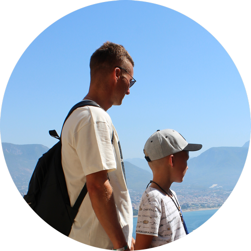

# Dzmitry Matul



## Junior Fronend Developer

### Contacts:

- **Telephone:** +48 789 63 57 57
- **email:** matuldmtr@gmail.com
- **[linkedIn](https://www.linkedin.com/in/dzmitry-matul-4340aba8)**
- **website**: <https://matuldmtr.pl/>

### Work experience:

  Company  |        Date         |   Post
---------- | ------------------- | --------
SPESS      | Feb 2023 - till now | Installer
MMPZ-group | Mar 2020 - Jan 2023 | Head of the power equipment repair
FSK        | Oct 2017 - Mar 2020 | Installer
Salamin    | Sep 2014 - Aug 2017 | Engineer
BSTM-2     | Aug 2011 - Sep 2014 | Engineer

### Code Example:
```
fetch("./gallery.json").then((response) => {
  return response.json().then((data) => {
    console.log(data);
  });
});
```
### Skills:
1. HTML
2. CSS
3. JavaScript
4. GitHub
5. Figma

### Education:
- Polack State University
- 2005 - 2010
- Heat and Gas Supply, Ventilation and Air Protection

### Languages:
- English - A2
- Russian - native
- Polish - B1